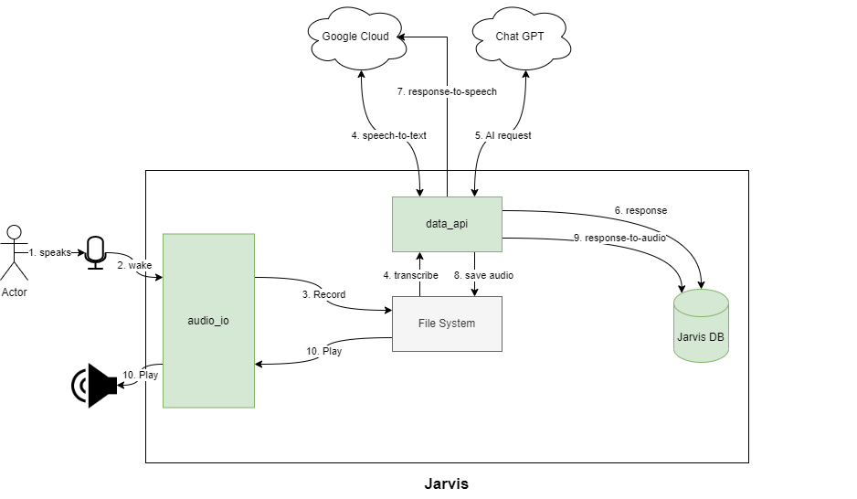

# Jarvis Voice Assistant

Jarvis is a voice assistant powered by Picovoice, Chat GPT, Google Speech to Text, and Text to Speech. It's designed to work on Linux-based systems with a connected microphone and speaker. Jarvis can understand voice commands, answer questions, and assist with various tasks.



## Installation

To get started, you need to install some dependencies:

```bash
sudo apt-get install -y python3-pyaudio sox libcairo2 libcairo2-dev portaudio19-dev python3-dev libpcre3 libpcre3-dev ffmpeg python3-pip sqlite3 alsa-tools
```

Next, set up a virtual environment, activate it, and install the required Python packages:

```bash
pip install virtualenv
virtualenv ENV
source ENV/bin/activate
pip install -r requirements.txt
```

### Picovoice Setup

1. Obtain an API key from Picovoice at [https://console.picovoice.ai/](https://console.picovoice.ai/).

2. Export the API key as an environment variable:

   ```bash
   export PICOVOICE_KEY=<your_picovoice_api_key>
   ```

### Chat GPT Setup

1. Obtain an API key from the OpenAI GPT-3 service at [https://platform.openai.com/account/api-keys](https://platform.openai.com/account/api-keys).

2. Export the API key as an environment variable:

   ```bash
   export API_KEY=<your_chat_gpt_api_key>
   ```

### Google Cloud Setup

1. Sign up for a Google Cloud account and create a new project at [https://cloud.google.com/](https://cloud.google.com/).

2. Enable the Speech-to-Text and Text-to-Speech APIs for your project.

3. Create a service account and grant it the necessary roles to access the enabled APIs.

4. Download the JSON key file for the service account and save it as `google-secret.json` in the project directory.

5. Export the path to the JSON key file as an environment variable:

   ```bash
   export GOOGLE_APPLICATION_CREDENTIALS=google-secret.json
   ```

## Usage

Once you have completed the setup, you can run the Jarvis voice assistant:

```bash
python main.py
```

Jarvis will be ready to listen to your voice commands and assist you with various tasks.

## License

This project is licensed under the MIT License - see the [LICENSE](LICENSE) file for details.